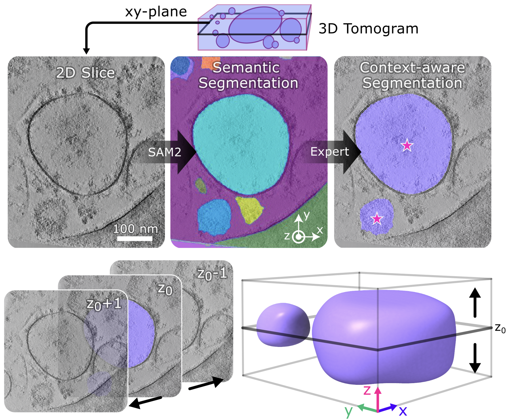

# User Guide Overview

SABER is a few-shot segmentation framework for electron microscopy data. It supports two distinct segmentation backends — **SAM2** and **SAM3** — which take fundamentally different approaches to the problem:

- **SAM2** proposes every possible segment in an image, then a lightweight domain expert classifier that you train filters the results down to the structures you care about. This is the recommended path for production work.
- **SAM3** takes a plain-language text description of the target structure and directly segments matching objects — no annotation or classifier training required. This is the fast path for exploration.

The three-stage workflow below describes the SAM2 path. If you want to skip annotation and training entirely, jump to [Inference](inference.md) and use the SAM3 zero-shot option.

---

## How SABER Works

SABER's workflow has three stages. Each stage can be run independently if you're entering mid-workflow.

=== "Stage 1 — Foundation Model Segmentation"

    SAM2's Automatic Mask Generation (AMG) densely samples the image with a grid of point prompts and produces *every possible segment* — organelles, membranes, contaminants, ice crystals, anything with a detectable boundary. The model has no concept of your target class at this stage; it just finds boundaries.

    !!! info "Why generate everything?"
        Rather than asking you to draw masks from scratch, SABER pre-computes all candidates. Your only job is to say which ones belong to which class. This shifts annotation from slow pixel-level drawing to fast point-and-click labeling.

    !!! note "SAM3 skips this stage entirely"
        If you use SAM3, the text prompt replaces Stages 1 and 2. SAM3 directly proposes only the structures matching your description — there are no candidates to curate and no classifier to train. See [Inference](inference.md) for details.

    This stage is run via `saber classifier prep2d` (micrographs) or `saber classifier prep3d` (tomograms).

=== "Stage 2 — Expert-Guided Classification"

    A lightweight neural network is trained on your click annotations to distinguish, say, lysosomes from mitochondria from background. During inference, this classifier scores every SAM2 candidate mask and keeps only the structures you care about.

    !!! info "How much annotation is needed?"
        As few as 20–40 annotated images is usually sufficient for a reliable classifier, especially when structures are morphologically distinct. More diverse data (multiple experiments, different imaging conditions) improves generalization.

    This stage is run via `saber classifier train`.

=== "Stage 3 — 3D Propagation"

    For tomographic data, the trained classifier generates masks on the central slab of each tomogram, and SAM2's video predictor propagates them through the full Z-stack. Because SAM2 was designed for object tracking across video frames, it handles gradual changes in organelle shape and density across Z naturally.

    !!! note "2D workflows stop at Stage 2"
        If you are working with 2D micrographs (single-particle EM, SEM, FIB-SEM slices), Stage 3 is not needed. `saber segment micrographs` handles the complete 2D pipeline.

    This stage is run via `saber segment tomograms`.

---

## Choose Your Starting Point

-   :material-play-circle-outline: **New to SABER?**

    ---

    Follow the full workflow from raw data to production segmentations.

    1. [Import Volumes](import-tomos.md)
    2. [Pre-processing & Annotation](preprocessing.md)
    3. [Train a Classifier](training.md)
    4. [Run Inference](inference.md)

-   :material-fast-forward: **Data already formatted?**

    ---

    Skip straight to generating SAM2 masks and annotating them.

    [:octicons-arrow-right-24: Pre-processing & Annotation](preprocessing.md)

-   :material-brain: **Have a trained classifier?**

    ---

    Go directly to running inference on new data.

    [:octicons-arrow-right-24: Inference](inference.md)

-   :material-code-braces: **Prefer the Python API?**

    ---

    Use the segmenter classes directly in your own scripts and pipelines.

    [:octicons-arrow-right-24: API Overview](../api/overview.md)

---

## Tutorial Sections

| Section | What You'll Do |
|---------|---------------|
| [Import Volumes](import-tomos.md) | Set up a Copick project and import MRC files |
| [Pre-processing](preprocessing.md) | Generate SAM2 masks and annotate them in the GUI |
| [Training](training.md) | Split data, train a classifier, and evaluate it |
| [Inference](inference.md) | Apply your model to 2D and 3D datasets at scale |
| [Membrane Refinement](membrane-refinement.md) | Post-process organelle + membrane segmentation pairs |
