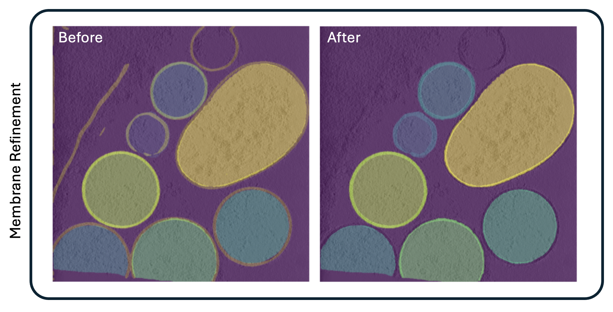

# Membrane Refinement

Membrane refinement is a post-processing step that cleans up organelle and membrane segmentation pairs, enforcing topological consistency between them. It is optional — only relevant if you have segmented both an organelle class and its bounding membrane.



*Left: raw binary segmentations with spurious membrane fragments. Right: refined masks with clean boundaries and unique instance labels matched to each organelle.*

---

## Why Refine Membranes?

Raw segmentation outputs frequently contain artifacts that affect downstream morphological analysis:

!!! warning "Common artifacts without refinement"
    - **Spurious fragments**: Small membrane pieces not attached to any organelle
    - **Boundary overlap**: Organelle masks extending slightly beyond their membrane
    - **Internal membranes**: Fragments inside an organelle that should be removed
    - **Edge artifacts**: Masks that clip at the volume boundary

Refinement resolves all of these by using the organelle mask to constrain the membrane and vice versa, producing paired masks that are geometrically consistent.

---

## Generating Initial Membrane Segmentations

SABER does not train membrane detectors — use [MemBrain-seg](https://github.com/teamtomo/membrain-seg) to generate high-quality initial membrane segmentations from cryo-ET data. MemBrain-seg is purpose-built for this task and integrates with Copick natively.

[:octicons-arrow-right-24: MemBrain-seg documentation](https://teamtomo.org/membrain-seg/)

---

## Running Refinement

### CLI

```bash
saber analysis refine-membranes \
    --config config.json \
    --org-info "organelles,saber,1" \
    --mem-info "membranes,membrane-seg,1" \
    --voxel-size 10 \
    --save-session-id "1"
```

**Specifying input segmentations** — the `--org-info` and `--mem-info` flags accept either a simple name or a full `name,userID,sessionID` triplet:

=== "Simple (uses first available)"

    ```bash
    --org-info "organelles"
    --mem-info "membranes"
    ```

    SABER picks the first matching user ID and session ID in the project. Use this for simple single-user projects.

=== "Full specification"

    ```bash
    --org-info "mitochondria,saber,3"
    --mem-info "membranes,membrain-seg,2"
    ```

    Explicit control over which user's and which session's segmentation to use. Recommended for multi-user projects or when you have multiple refinement runs.

**What gets saved:**

| Input | Output |
|-------|--------|
| `organelles` (user `saber`, session `1`) | `organelles` (user `saber-refined`, session `1`) |
| `membranes` (user `membrane-seg`, session `1`) | `membranes` (user `membrane-seg-refined`, session `1`) |

??? note "`saber analysis refine-membranes` Parameters"
    | Parameter | Description | Example |
    |-----------|-------------|---------|
    | `--config` | Copick config file | `config.json` |
    | `--org-info` | Organelle segmentation query | `"organelles,saber,1"` |
    | `--mem-info` | Membrane segmentation query | `"membranes,membrane-seg,1"` |
    | `--voxel-size` | Voxel size in Å | `10` |
    | `--save-session-id` | Session ID for refined outputs | `"1"` |

---

### Python API

For custom refinement workflows or parameter sweeps:

```python
from saber.analysis.refine_membranes import OrganelleMembraneFilter, FilteringConfig

config = FilteringConfig(
    ball_size=5,                  # (1)
    min_membrane_area=10000,      # (2)
    edge_trim_z=5,                # (3)
    edge_trim_xy=3,
    batch_size=8,                 # (4)
    keep_surface_membranes=False, # (5)
)

filter_obj = OrganelleMembraneFilter(config, gpu_id=0)
results = filter_obj.run(organelle_seg, membrane_seg)

refined_organelles = results['organelles']
refined_membranes  = results['membranes']
```

1. Morphological kernel radius. Larger values smooth boundaries more aggressively.
2. Minimum voxel count for a membrane component to be kept.
3. Voxels to trim from Z-edges to remove boundary artifacts.
4. GPU batch size. Reduce if running out of memory.
5. Set to `True` to keep only surface-facing membranes and remove internal fragments.

??? note "`FilteringConfig` Parameters"
    | Parameter | Type | Default | Description |
    |-----------|------|---------|-------------|
    | `ball_size` | int | `3` | Morphological kernel radius — larger values smooth boundaries more aggressively |
    | `min_membrane_area` | int | `10000` | Minimum voxel count for a membrane component to be kept |
    | `edge_trim_z` | int | `5` | Voxels to trim from Z-edges to remove boundary artifacts |
    | `edge_trim_xy` | int | `3` | Voxels to trim from XY-edges |
    | `batch_size` | int | `8` | GPU batch size — reduce if running out of memory |
    | `keep_surface_membranes` | bool | `False` | Set `True` to keep only surface-facing membranes and remove internal fragments |

??? tip "Parameter tuning guide"
    | Symptom | Adjustment |
    |---------|-----------|
    | Too many small membrane fragments remaining | Increase `min_membrane_area` |
    | Valid structures being removed | Decrease `ball_size` or `min_membrane_area` |
    | Artifacts at volume edges | Increase `edge_trim_z` or `edge_trim_xy` |
    | Internal membrane fragments inside organelles | Set `keep_surface_membranes=False` |
    | GPU out of memory | Decrease `batch_size` |

---

## Next Steps

<div class="grid cards" markdown>

-   [:octicons-arrow-right-24: **Export Statistics**](inference.md#exporting-statistics)

    Extract per-organelle volume, diameter, and coordinates from refined segmentations.

-   [:octicons-arrow-right-24: **MemBrain-seg**](https://teamtomo.org/membrain-seg/)

    Generate the initial membrane segmentations that this workflow refines.

</div>
