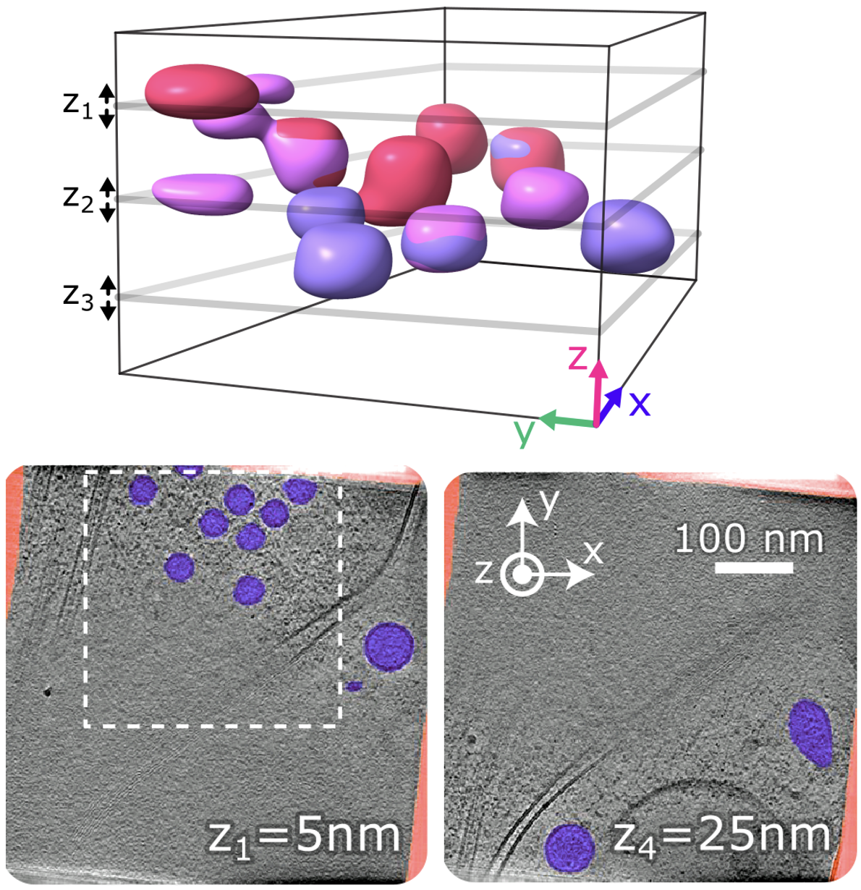
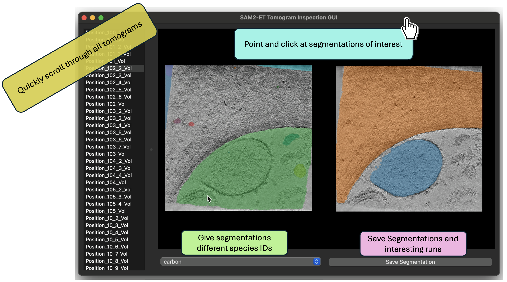

# Pre-processing Your Data

Pre-processing is where SABER inverts the traditional annotation burden. Instead of drawing masks from scratch, you run SAM2 once to generate all possible segments, then use the GUI to assign class labels by clicking. This page covers both the CLI commands and the annotation workflow.

---

## Supported File Formats

<div class="grid cards" markdown>

-   :material-microscope: **Cryo-ET / EM**

    ---
    `.mrc`, `.zarr`

-   :material-image: **Light / Fluorescence**

    ---
    `.tif`, `.tiff`

-   :material-atom: **Materials Science**

    ---
    `.ser`, `.dm3`, `.dm4`

</div>

---

## Step 1: Generate Initial SAM2 Segmentations

=== "Tomogram Data (3D)"

    Use `prep3d` to slice the tomogram at multiple Z-depths and segment each slab with SAM2. The output is a Zarr file containing the original images, all SAM2 masks, and metadata.

    ```bash
    saber classifier prep3d \
        --config config.json \
        --voxel-size 10 \
        --tomo-alg denoised \
        --num-slabs 3 \
        --zarr-path training.zarr
    ```

    ??? question "Why multiple slabs?"
        Small or sparse structures may not appear in every Z-depth. By sampling 3 slab projections at evenly spaced depths, SABER maximizes the chance of capturing every instance of your target organelle — especially important for structures that appear sporadically through the volume.

        

    ??? note "`saber classifier prep3d` Parameters"
        | Parameter | Description | Default |
        |-----------|-------------|---------|
        | `--config` | Copick config file | required |
        | `--voxel-size` | Tomogram resolution in Å | `10` |
        | `--tomo-alg` | Reconstruction type (`denoised`, `wbp`) | `denoised` |
        | `--num-slabs` | Number of Z-depths to sample | `3` |
        | `--zarr-path` | Output Zarr file | required |

=== "Micrograph Data (2D)"

    Use `prep2d` to run SAM2 across a folder of micrograph files. Each image is segmented and all masks are stored in the output Zarr alongside the original data.

    ```bash
    saber classifier prep2d \
        --input 'path/to/micrographs/*.mrc' \
        --output training.zarr \
        --target-resolution 10
    ```

    !!! tip "Resolution matters"
        For `.mrc` files with embedded pixel size metadata, use `--target-resolution` (in Å) to automatically downsample to a segmentation-friendly resolution. For `.tif` files without metadata, use `--scale N` to downsample by a fixed factor instead.

    ??? note "`saber classifier prep2d` Parameters"
        | Parameter | Description | Default |
        |-----------|-------------|---------|
        | `--input` | File path or glob pattern | required |
        | `--output` | Output Zarr file | required |
        | `--target-resolution` | Target resolution in Å (for MRC) | — |
        | `--scale` | Downsampling factor (for TIF) | — |

---

## Step 2: Annotate with the SABER GUI

Launch the interactive annotation GUI to label the SAM2 masks:

```bash
saber gui --input training.zarr
```



!!! info "How annotation works"
    1. **Browse** through the pre-computed SAM2 segmentations.
    2. **Click** on a mask to select it.
    3. **Assign a class** using the menu on the right.
    4. **Save** the resulting JSON file using the button in the lower right.

    You never draw masks by hand — you only classify what SAM2 has already found.

!!! tip "How many images to annotate?"
    - **20 images**: When multiple instances of your target appear per image
    - **40 images**: When instances are sparse or the structure varies significantly
    - Prioritize **diversity** over volume — data from multiple experiments generalizes better than many images from a single session.

### Transferring Data Between Machines

If you annotate on a local workstation but train on an HPC cluster, compress the Zarr before transferring:

```bash
zip -r training.zarr.zip training.zarr
```

---

## Step 3: Apply Annotations

After downloading the JSON file exported from the GUI, apply the annotations to the Zarr to create a training-ready labeled dataset:

```bash
saber classifier labeler \
    --input training.zarr \
    --labels labels.json \
    --classes lysosome,carbon,edge \
    --output labeled.zarr
```

??? note "`saber classifier labeler` Parameters"
    | Parameter | Description | Default |
    |-----------|-------------|---------|
    | `--input` | Zarr containing SAM2 masks | required |
    | `--labels` | JSON file exported from the GUI | required |
    | `--classes` | Comma-separated class names; controls index ordering | alphabetical |
    | `--output` | Output labeled Zarr | required |

    The background class is always index `0`. If `--classes` is omitted, all annotated classes are used in alphabetical order.

---

## Quick Assessment: Is Your Data Segmentable?

Before committing to a full annotation campaign, run a quick zero-shot preview to see what SAM2 naturally detects in your data.

=== "2D Preview"

    ```bash
    saber segment micrographs \
        --input path/to/image.mrc \
        --target-resolution 10
    ```

    SABER opens an interactive view with all SAM2 masks overlaid. If your target structures are clearly outlined, you're ready to annotate. If they're fragmented or missing, try adjusting the resolution.

=== "3D Preview (Single Slab)"

    ```bash
    saber segment slab \
        --config config.json \
        --voxel-size 10 \
        --tomo-alg denoised \
        --slab-thickness 10 \
        --run-id Position_10_Vol
    ```

    This segments a single Z-slab interactively, giving you a fast preview of segmentation quality before running the full volume.

=== "3D Preview (Full Volume)"

    ```bash
    saber segment tomograms \
        --config config.json \
        --voxel-size 10 \
        --tomo-alg denoised \
        --slab-thickness 10 \
        --run-ids Position_10_Vol
    ```

    Runs the full 3D segmentation workflow on a single tomogram and displays the result.

---

## Next Steps

Once your labeled Zarr is ready:

<div class="grid cards" markdown>

-   [:octicons-arrow-right-24: **Train a Classifier**](training.md)

    Split your data and train a domain expert classifier.

-   [:octicons-arrow-right-24: **Run Inference**](inference.md)

    Already have a trained model? Skip straight to applying it.

</div>
