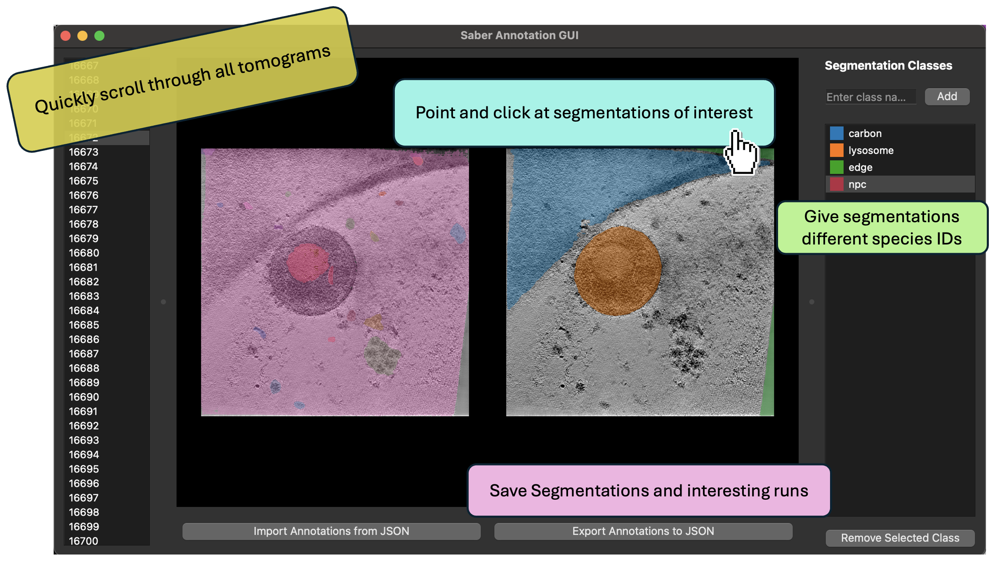

# Pre-processing Your Data

Pre-processing is the first step in the SABER workflow. Here, you'll prepare your electron microscopy (EM) or cryo-electron tomography (cryo-ET) data for segmentation and annotation. SABER supports a wide range of file formats and provides flexible commands for both tomograms and single-particle micrographs.

---

## 🗂️ Supported File Types

SABER can read and process the following file formats:

- **MRC** (`.mrc`)
- **TIFF** (`.tif`, `.tiff`)
- **Zarr** (`.zarr`)

**Material science formats:**  

  - **SER** (`.ser`)
  - **DM3/DM4** (`.dm3`, `.dm4`)
- ...and more!

---

## Playing with SAM2 Segmenations

Before preparing training data for the classifier, we can quickly assess whether our data is suitable for the SABER workflow. To inspect the raw SAM2 segmentations for micrographs we run 

```bash
saber segment micrograph \
    --input path/to/image.mrc
```

and for tomograms we can run

```bash
saber segment slab \
    --config config.json 
```

## 🧩 Producing Initial SAM2 Segmentations

For **tomograms**, use the `prepare-tomogram-training` command to generate 2D segmentations using SAM2-style slab-based inference. These masks serve as a rough initialization for downstream curation and model training.

```bash
saber classifier prepare-tomogram-training \
    --config config.json \
    --zarr-path output_zarr_fname.zarr \
    --num-slabs 3
```

This will save slab-wise segmentations in a Zarr volume that can be reviewed or refined further.

---

## 🧬 Pre-processing Electron Micrographs

If you are working with datasets collected for single particle, ADF/BF signals from S/TEM, or from FIB-SEM microscopes (**micrographs**), use the `saber classifier prepare-micrograph-training` command:

```bash
saber classifier prepare-micrograph-training \
    --config config.json \
    --zarr-path output_micrograph_zarr.zarr
```

This command supports the same wide range of file types as above.

---

## 🎨 Next Step: Annotation with the SABER GUI

Once your data is pre-processed, you can launch the interactive GUI to review and annotate segmentations:



```bash
saber gui \
    --input output_zarr_fname.zarr \
    --output curated_labels.zarr \
    --class-names carbon,lysosome,artifacts
```

**Tip:** For transferring data between machines, it's recommended to compress your Zarr files:
```bash
zip -r curated_labels.zarr.zip curated_labels.zarr
```

---

_Ready to move on? Check out the [Training a Classifier](training.md) tutorial!_
